# [MakeWebWork](http://makewebwork.azurewebsites.net)

Link to the website [MakeWebWork](http://makewebwork.azurewebsites.net)

MakeWebWork is a website for me to sell my websites in the future. There is still lots of work to be done before it's completed it needs to be able to take payments and quote prospective customers and allow them to contact me with their requests so I can gauge interest in the project.

The website when it is completed should be a group of JS and CSS files that when the designer is created will be able to recognize patterns in HTML and turn them into interactive webpages enabling unmatched web development speed. The JS files also need to have built-in debugging so that developing the designer will be much easier. 

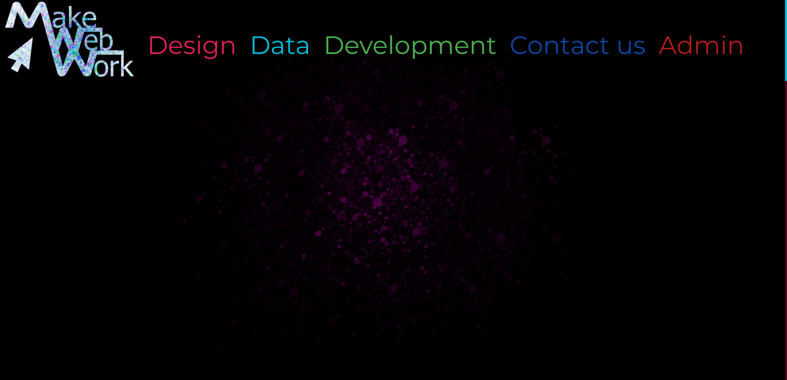

Desktop and background credit: [pixabay](https://pixabay.com/photos/apple-computer-desk-workspace-1868496/)

# Table of contents
1.  [User stories](#user_stories)
  - [story 1](#story_1)
  - [story 2](#story_2)
  - [story 3](#story_3)
  - [story 4](#story_4)
  - [story 5](#story_5)
  - [story 6](#story_6)
  - [story 7](#story_7)
  - [story 8](#story_8)
2.  [Wireframes](#wireframes)
  - [Interactive](#interactive)
3.  [Challenges](#challenges)
  - [centering big images](#centering_big_imgs)
  - [Navbar](#Navbar)
  - [Transparency](#transparency_without_inherit)
  - [Funky form handler](#I_make_life_hard_4_me)
  - [Journeys](#Favourite_part)
4.  [Technology used](#technology_used)
  - [Wireframes](#wireframes)
  - [Frameworks](#frameworks)
  - [Libraries](#libraries)
5.  [Features left to implement](#features-left-to-implement)
  - [designer](#I_am_way_too_ambitious)
6.  [Manual testing](#testing)
  - [story 1](#story_1_testing)
  - [story 2](#story_2_testing)
  - [story 3](#story_3_testing)
  - [story 4](#story_4_testing)
  - [story 5](#story_5_testing)
  - [story 6](#story_6_testing)
  - [story 7](#story_7_testing)
  - [story 8](#story_8_testing)
7. [Validator testing](#validator-testing)
8. [Unfixed-bugs](#unfixed-bugs)
9. [Deployment](#deployment)
10. [Credits](#credits)
11. [Notes for assessor](#notes-for-assessor)
12. [To Do List](#to-do-list)

# User stories 

## business owners

Business owners should be able to look at the website and see what my website has to offer them get a rough quote and contact me

## large companies

Large companies should be able to purchase a website directly from me where they would be able to support the site themselves using the designer I will build in the future

## potential companies

Potential companies can put in a request to tell me about their ideas for their businesses and I would be able to choose any that seem promising to invest in them with a website and benefit from their growth

## website owner

See a user's requests and contact details to be able to reply to the user

## general use 

The HTML, javascript, and CSS should follow a reusability standard to allow me to create predictable behavior in the designer when it is completed.

## Story 1 
Me the website owner should be able to use the Django admin site to manage the website and change prices of modules and the ratios used to calculate the various web development costs on the journey pages. I should also be able to view all requests along with contact details to get back to the users.

## Story 2 
A user should be able to log in and sign up

## Story 3 
A user should be able to reset their password and verify their emails

## Story 4 
A user should be able to make a request describing what they would like from MakeWebWork. And I should be able to send them a link via email or text to respond to the user. 

## Story 5
A user should be able to get a rough quote from the site before contacting us if that's what they wish to do. 

## Story 6 
A user should be able to use many of the features that will be available in the designer as smart features. Things like journeys, animations, selection forms, selection information pages, and many more. 
 
## Story 7 
A user should be able to gather information about the abilities available on the future website. 

## Story 8 
A user should be able to purchase on the website

# Wireframes

### Adobe XD

[interactive wireframe](https://xd.adobe.com/view/5aa4db6e-c5ca-4e7f-98bf-da8ac5b93b1f-0ff7/?fullscreen)

This is the best way other than using the site to get an idea of how everything works. There are no other wireframes created for this app as I went straight to a digital wireframe. The wireframe was also only followed loosely the final product ended up being a lot more complex with things that can't be recreated in Adobe XD

# Challenges overcome 

# Centering image 

This may seem like an easy task but no matter what I was doing I couldn't center the image as according to a Google search you can only center align something smaller than 100% 

This led to me going down the route of calculating the position to be exactly the middle this is a breakdown of the calculation

The image width is determined by the height so I had to get the ratio of the image which is 16:9 

This enabled me to calculate the width by using the ratio done by dividing by the height (9) and multiplying by the width (16)

So now I had the width I just needed a surefire way to position it in the same place each time so using left I then did the calculation again but this time using half the vh this
Center the image to the left perfectly 

Finally, I added 50vw to the total which centers the image in the middle of the screen regardless of viewport height try it out it works perfectly. There is likely a less complex way of 
doing this but I couldn't find it.

This is the CSS code to look out for:
left:calc(calc(calc(calc(50vh / 9) * 16) - calc(calc(100vh / 9) * 16)) + 50vw);

Another benefit of this is my animation became easier by just scaling the vh against the scroll position 

I ended up having to create this in javascript afterward the javascript code is a little cleaner though.

# Navbar not working 

This was a frustrating issue early in development the navbar kept breaking.

At the stage of writing this, I am currently still trying to understand what the issue is. I am taking a guess 
that it's something to do with the load times where the system is loading the js file before the DOM is ready slightly disappointing that Bootstrap didn't think of that being an issue but will add an event listener to make sure the DOM is loaded first.

Turns out I was misusing blocks in Django I was overwriting postloadJS whereas I thought calling block tag was extending I understand that a little better to avoid the issue again I added an empty block called "extrapostjs" where I will add extra JS files for specific pages.

# Colors unable to easily add transparency 

This was me thinking about me in the future the easy way to get around this is to add opacity and set that to a value but that means that the element below inherits the opacity... This was a slight problem, not a big one really but due to me wanting to make a designer eventually. I quickly looked into how to not inherit opacity. Turns out it's relatively simple just use RGBA to set color easily!

The only issue is that materialize is sert using hex values. Yuck makes sense as it's more efficient in saving valuable space! How do I fix this then? Due to my prior knowledge of Adobe software and Photoshop, I knew that Hex is RGB.

Hex uses the first value and multiplies it by 16 a b c d e f mean 10 11 12 13 14 15 respectively 15*16 is 240 the second letter is taken at face value. 

So the max value is 15 * 16 + 15 which is 255. So all I had to do was create a script to look at Materialize's code and edit it. To be lazy I took the entire CSS file into Word and used replace on paragraphs to make each rule sit on its line I didn't want it to happen for the } though as they would all be on the same line and I wanted to do a line at a time to for loop through. So I did another replacement to add a paragraph after }. 

Then I created a quick and dirty Python script and set it to print out the values I wanted. then > the output to another file called newcolors took a few attempts and then I sorted it. The script takes less than a second to run creating a 5k line css file. The next challenge is to create a quick and dirty Python file to slap those into a database so I can add the individual colors in style tags in the designer allowing me to very efficiently serve user-created HTML later but I can imagine that will show up in a later challenge

# Form handler for my contact options page 

The page that accepts the input is a single form split into multiple chunks each chunk can have 10 questions each 
there is one part that always displays which is I am a human. so the answers to that need to map to the customer 
table a request number needs to be the link between the customer table and the rest of the questions 

So how do I create a form that has 40 plus fields where only sometimes fields are used and the validation needs to 
only trigger if the option was chosen originally? So the structure coming from the front end is a mystery. 

I also would love to have the fields saved during the editing process they can be very big answers like What's your
idea? I tried explaining this website as an idea in less than 2,000 characters... No chance but we all know what it's like
You've just written a whole bunch of text and bam you hit a wall can't think of the next bit leave the page come back and
all your hard work is gone. So the system needs to as soon as an account is created create an account create a request number
and put any answers in the table with an incomplete tag so that when I am looking through requests I don't see the incomplete ones.

One way to solve this would be to have the individual blocks of questions be saved individually without a page refresh. Also, 
the system is refreshed to not reset to the way it was before. So if the user is logged in it needs to know what options were
already selected... Sounds like my JS file needs to be able to access the table. Or I have a hidden field at the top of the page
which is created by the backend and contains an attribute called "previouschosenoptions" that gets passed through the submit function
straight away... Which would display the correct blocks. If the user already logged in then it could use that to autofill the inputs 

But say the user refreshes and changes their options there will be data in the hidden sections. So, I need to segment them into separate 
saves so you save and the next one pops open. Maybe some animations could be used here to make the save process more exciting to the 
user. This allows me to handle each part separately and it all gets sent to the same table apart from the customer one at the start.

This seems doable now but likely very complex. The things I will do to make my UX fit my mind's eye...

Data solution 

table one customer
unique ID primary key
name 
lastname 
etc.

Table 2 request table
Unique ID (foreign key customer table)
Request ID primary key

Table three questions table 
Question ID primary key
request ID foreign key request table
question 1 question
question 1 answer 
question 2 question 
question 2 answer
etc 

This allows one customer to have multiple requests 
and each request to have multiple questions 

Javascript needs to get the submit use the label values as the questions 
then match them with the answers using the for on the labels to match to the answers

Will need to take the label value at the beginning of the page load and then make the links 
remembering the IDs and saving the actual input elements rather than what their IDs were. Why? 
So that a user can change the format of the questions, change the labels, and submit bad data
for nefarious reasons or because they want to.

This allows me to only validate fields that are not hidden and only submit data of the particular block as well.

So this will handle every separate contact option the 
same way. Will need to have a unique form reference to
group all the answers. 

Also allows flexibility in the future so I can add groups and
change questions whenever I like without any additional changes
to the form handler. 

and have a foreign key to a customer table allowing 
a multiple-to-one relationship 

# Price calculator 
I wanted to create a unique experience for the user allowing them to choose a pricing model and have the page slide off and be replaced by the input screen. There is no need to submit these quotes or save them currently so will have inputs on the left and to the right, and the answer will show up. The challenge here is to 

# Technology used

## Wireframes
- adobe XD

## Frameworks
- I used the Django framework
- I used GitHub to store the repository and version management
- I used Gitpod for editing the code and for posting to GitHub 

## Libraries
- bootstrap
- materialize

### Features Left to Implement

## Designer

The designer was meant to be the standout feature on this website guaranteeing me a distinction but turns out that a content management system is a very complicated piece of work.
So scrapped it and just focused on reusable code setting the foundations for the CMS in the future.

## Manual testing 

## Story 1 
Me the website owner should be able to use the Django admin site to manage the website and change prices of modules and the ratios used to calculate the various web development costs on the journey pages. I should also be able to view all requests along with contact details to get back to the users.

To test this functionality

- Log into the website as an admin account 
- Click the red admin link on the top right of the page
- Click standard admin
- This will be a link to the Django backend where models will be changeable.

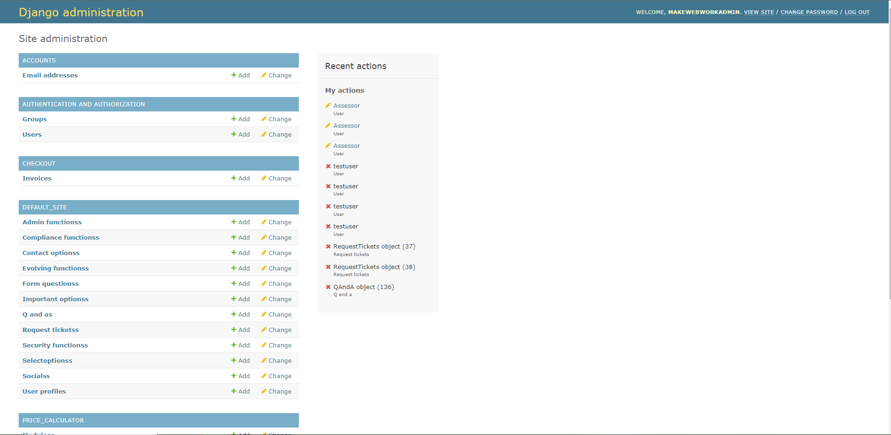

## Story 2 
A user should be able to log in and sign up

To test the sign-up functionality 

- Click login at the top of the home page 
- Click sign up
- Enter details 
- An account should be created on the database and the user will now be able to log in or log out

To test login functionality

- Click login at the top of the home page 
- Click login 
- Enter details 
- To see whether you have successfully logged in a profile link should now be present for a regular user and for a super user an admin link should be present

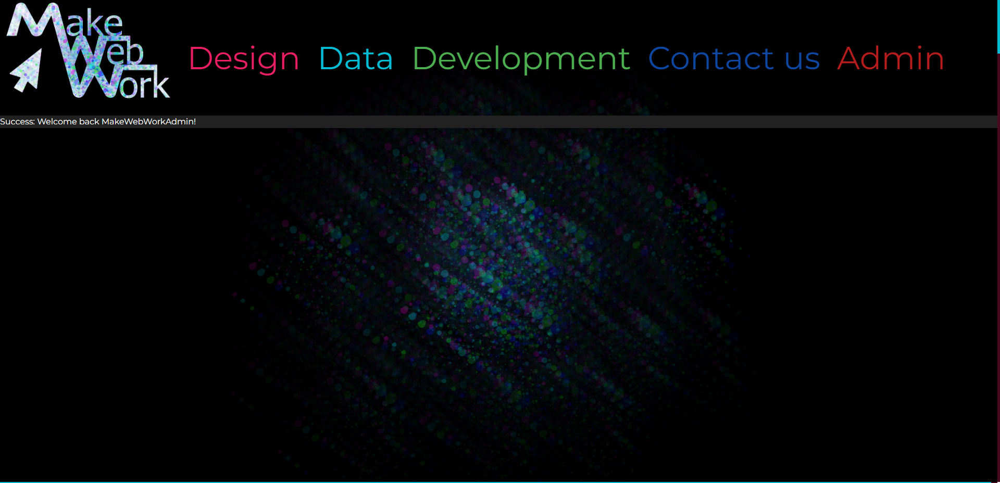

## Story 3 
A user should be able to reset their password and verify their emails

To test email verification

- After signing up you will be able to verify your email. (this isn't required, however). To verify your email click the profile link.
- click the option to log out.
- On the new navigation bar you'll see the option to change e-mail.
- When you are on this page it will allow you to resend the verification link.
- Clicking this will send an email to your inbox.
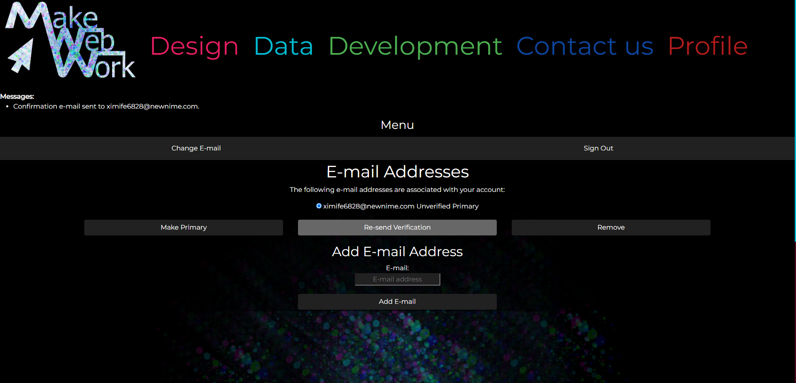
- Navigate to your mailbox click the link and you'll be led to a page that asks if you would like to confirm.
- Selecting confirm verifies your email.
- After confirming the email the user should then be able to see on the change email page that their email is verified.
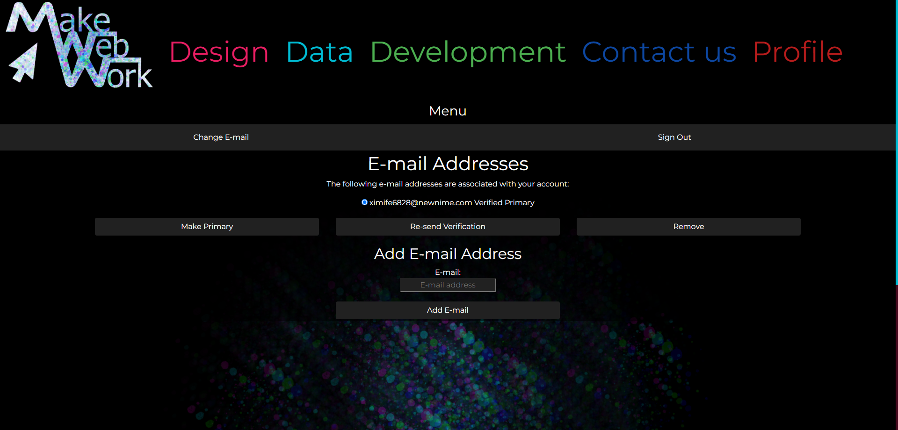

To test password reset

- Go to the login screen click on forgotten password and request an email the email will contain a link for you to be able to reset your password
- Clicking the link will allow you to change your password 
- After changing the password you should be able to use the new password to log in.

## Story 4 
A user should be able to make a request describing what they would like from MakeWebWork. And I should be able to send them a link via email or text to respond to the user.

- From the homepage navigate to contact us
- Select a relevant form to fill out.
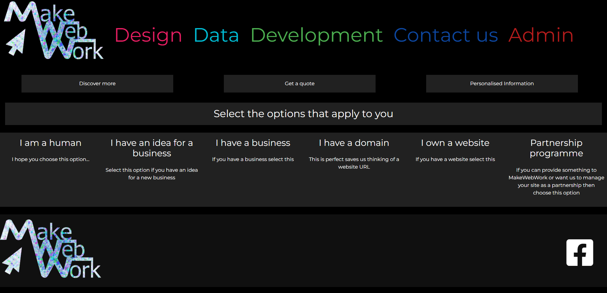
- Pressing submit sends the request.
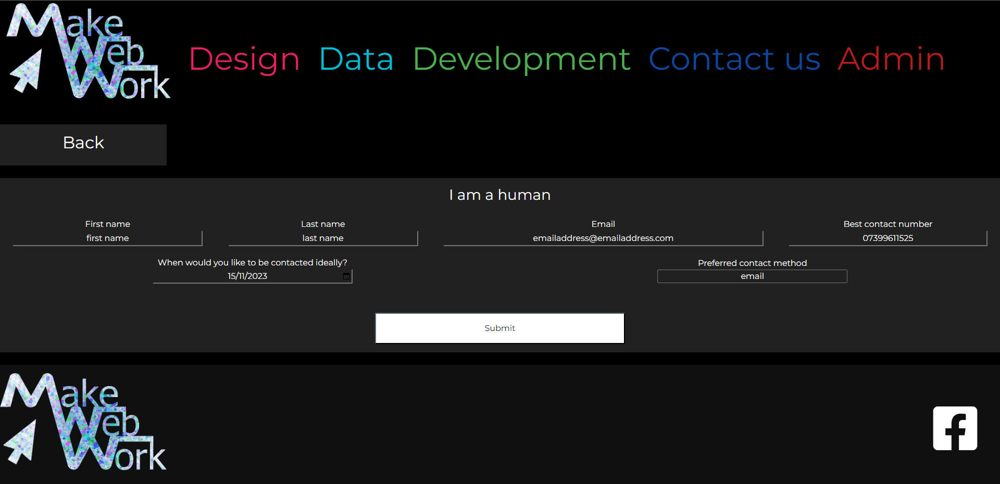
- To access the request you need to log in as an admin account (user and password at bottom of the readme)
- Once logged in as an admin go to the admin tab
- Select the requests option 
- You will now see a list of recent requests expanding them will give more details.
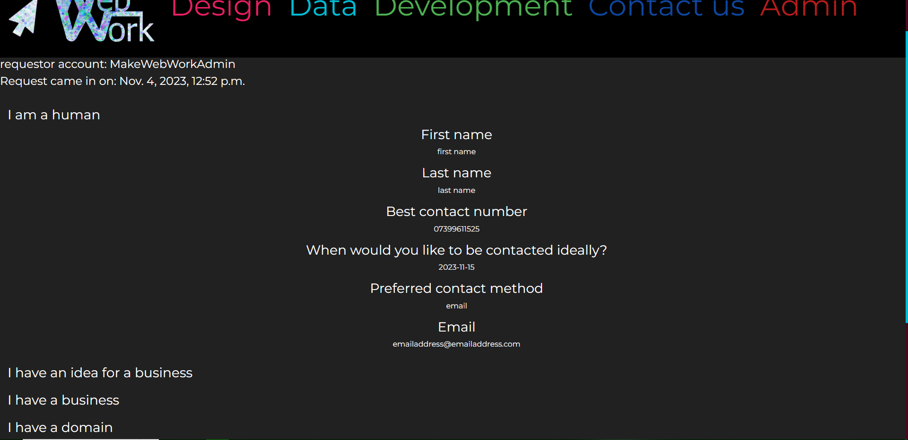

## Story 5
A user should be able to get a rough quote from the site before contacting us if that's what they wish to do. 

To test this functionality

- From the homepage go to Contact us 
- At the top of the page there is a button to get a quote
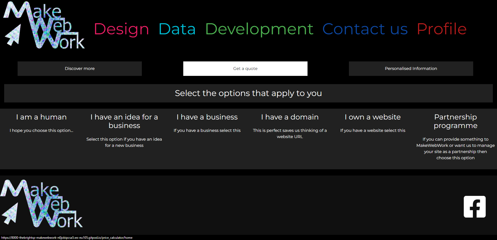
- Select the build and buy option 
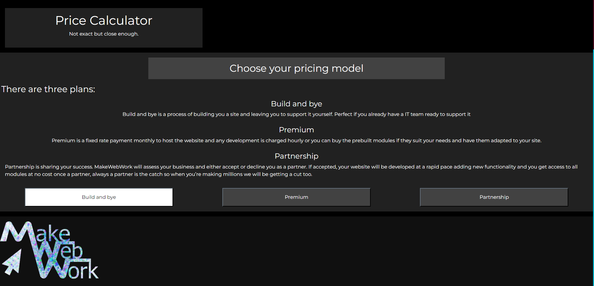
- Select the subscription option
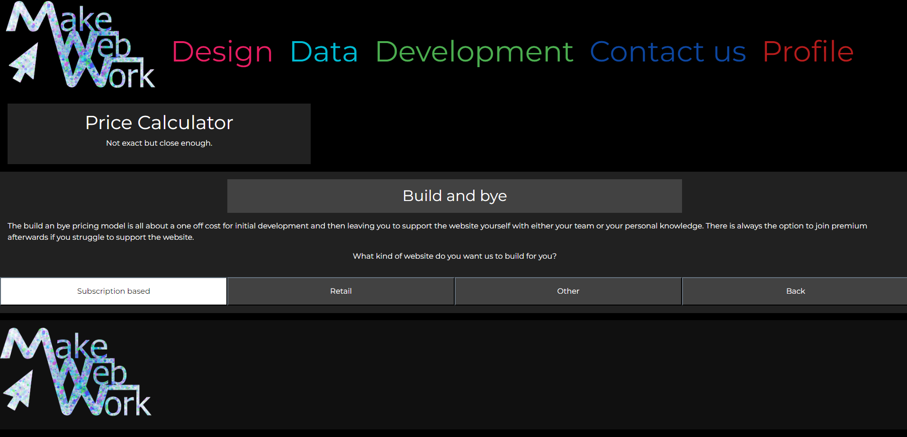
- Changing any of the amounts on this page will increase the total cost
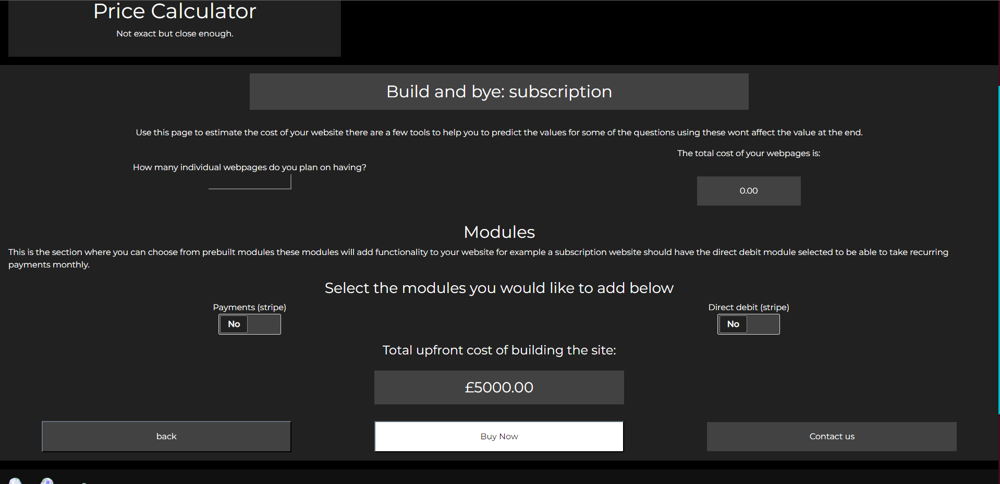

## Story 6 
A user should be able to use many of the features that will be available in the designer as smart features. Things like journeys, animations, selection forms, selection information pages, and many more. 

Journeys are testable by accessing the get a quote section of the website. This is a javascript file that handles the transitions cleverly
- From the homepage go to the Contact Us tab
- Then choose the Get a Quote link

- Clicking the various options is how you identify if the system is working it should either animate left or right depending on the direction of travel.

Selection forms are testable by accessing the personalized information section of the website is a javascript file that handles the size of the selection and displays the relevant information
- From the homepage go to the Contact Us tab
- Then choose the personalized information link
- Clicking the various options and then submitting will display more detailed info about the various options and if relevant for example price will display a get a quote link
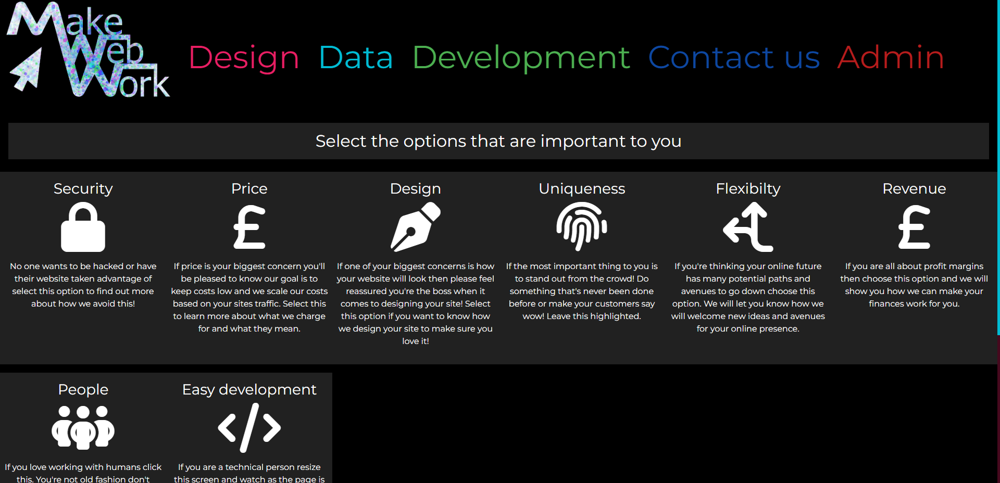

 Animations are testable by scrolling on any of the main home pages. The easiest one to identify is the homepage.
 - Navigate to the homepage and scroll down
 - If the circles move onto the screen then the animation javacript file is working correctly.

 Selection forms are another smart feature accessible via the Contact Us page 
 - From the homepage select the Contact Us tab
 - Click on relevant options press submit and you will be presented with relevant questions based on your selection.
 

## Story 7 
A user should be able to gather information about the abilities available on the future website. 

- This information is available on the homepage, design, data, and development tabs you can also get more info on the personalized info link on the Contact Us page.
- If there is useful information on these pages then the test is a pass

## Story 8 
A user should be able to purchase on the website

- There is only one journey route that accepts payment this is on purpose.
- There are many links to the calculator page you can either go to the Contact Us section or at the bottom of the homepage, design, data, or development pages
 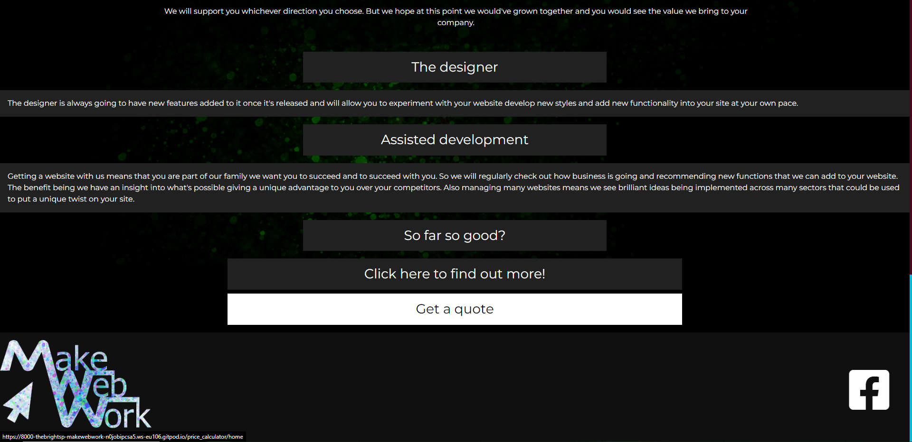
- Next, choose the build and bye link
 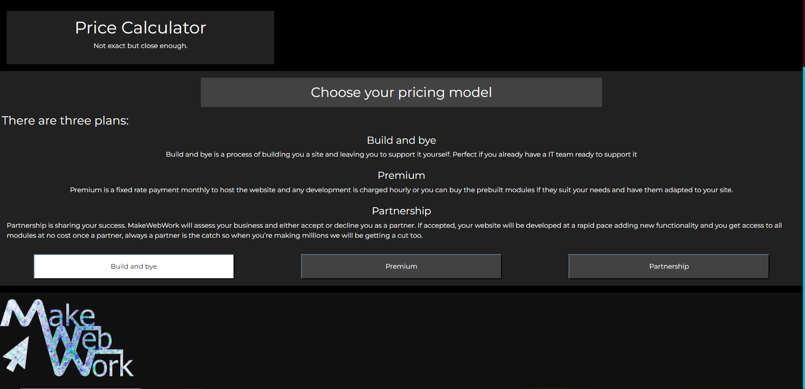
- Next, choose subscription based
  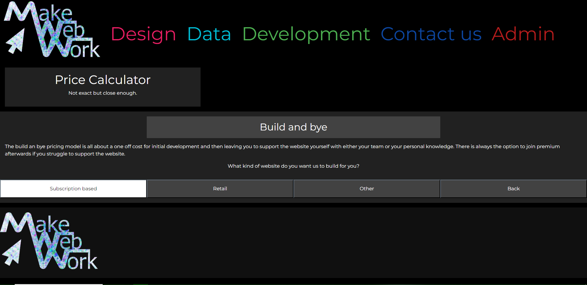
- Next, choose the Buy Now link
 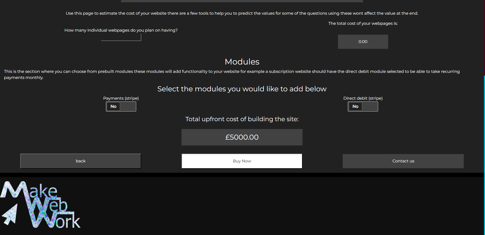
 - On this screen, there are multiple options for inputting card details. Here are a few examples 4242 4242 4242 4242 normal payment 4000000000000002 general decline 4000000000009995 insufficient funds decline, all will function with no issues. a more extensive list can be found at https://stripe.com/docs/testing?locale=en-GB
- After choosing a test case above click pay now
 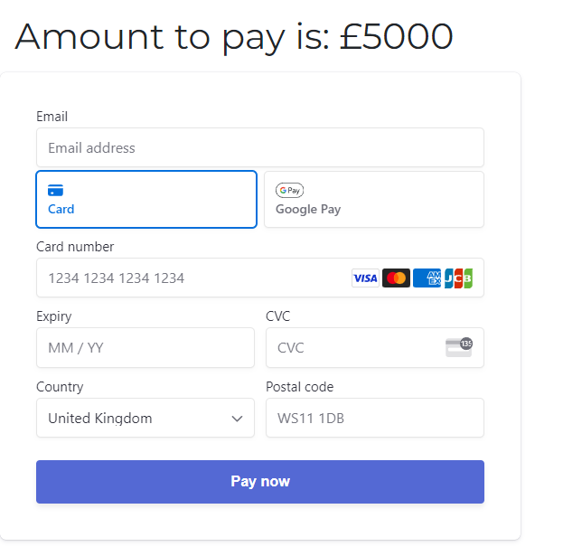
- Depending on the card number you have entered you will be either redirected to the confirmation page or an error message will appear on the payment screen. The example below is a successful payment
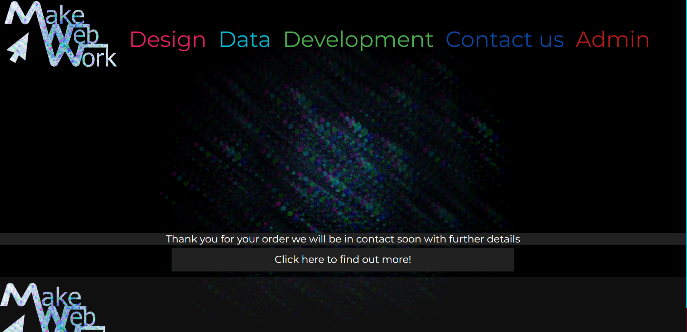

# Automatic testing 

So my "automatic testing" is logged on the console if the value of debug is set to true on the various javascript files. Therefore doesn't qualify as true automatic testing

## Img_scroll.js

If you set debug to true it will run automatic tests to determine whether you've made a mistake in your animationprops or if you're missing any properties such as an ID or animationprops. The debugger will also continuously spit out each update and the variables it uses to do its calculations which can lead to an overdose of information.

The reason I implemented the tests directly into the file is so that when users use the designer it will spit out easy-to-understand errors and make my life much easier when trying to debug the code.

Jest while it's likely capable of what I am doing here would be extremely difficult to implement to the level I have implemented in these tests.

The only way to manually test is to see if you put in good info into the start, end, startpos, endpos, and direction properties if so it'll do what you want if not it won't. It can be a little difficult to understand initially but it becomes intuitive after a while.

## Selection.js

The purpose of this JavaScript file is to allow users to make multiple selections on the page and have more information or a form displayed. Based on their selections of course. Allowing users to only input information that is relevant to what they want. 

If debug is true it outputs a message to say it is connected and it also allows you to press the space bar to display the elements that have been detected in blue and finally checks if there is a submit button present or a form button. 

It doesn't also output the selection elements separately as well although not very helpful 

## Utility.js

This is all about holding general JavaScript functions such as the hide toggler. It also serves another purpose which is looking for general mistakes in the HTML. For example duplicate IDs

The automatic test output to the console if debug is true all of the elements that are duplicated using queryselectorall to output a list of hyperlinked elements so you can click them and it will display the elements in the elements tab.

## Calculator.js

This JavaScript is all about taking an input and looking for a target if it finds a target it will use the calc attribute to convert the input into the target. 

The automatic tests run if debug is true. It will check if it can parse a value through to you each input and check the output without actually sending a value. This will output any inputs that failed the test to the console. It will also tell you where it went wrong for example the target doesn't exist or the calc is invalid. 

## Journey.js

This JavaScript is all about detecting a pattern in the html file and if it discovers a pattern it links buttons and their targets. It creates a journey object that contains the parent ID and all the links within that ID

The automatic tests check the structure of the journey object if debug is true and ensure that every link points to another parent if it doesn't it outputs the parent html and the option that was pointing towards it. 

# Validator Testing 

## HTML
type attributes, attribute errors are ignored as they are required by javascript
lang errors are ignored due to lack of time to resolve
info was also ignored due to a lack of time to resolve
The price calculator page has a lot of errors due to the custom attributes I used and I used A LOT of them...
testing was done using:
[W3C validator](https://validator.w3.org/)
# CSS
No errors found using:
[CSS validator](https://jigsaw.w3.org/css-validator/)
# JS
ignored es6 warnings due to lack of development time 

# Unfixed Bugs 

No unfixed bugs that I am currently aware of!

# Deployment 

I was using GitHub as the repository for the whole project so when I wanted to create a live page it was very easy to do.

## How to clone repository:
 - Go to my GitHub repository
 - Click the code option and then copy the link
 - If you have git installed on your pc you can use git clone followed by the URL 

## How to deploy to Azure:

- The site was deployed to the Azure platform. The steps to deploy are as follows:

- fork repository

- I used Gitpod to develop this application so instructions are easier to follow using that

- The arm template is found on this repo it's in the file called armtemplate.json

- Create an Azure account I recommend using GitHub to sign up 

- Log out of Azure wait 15 minutes then log back in or you'll get an annoying error later on saying it can't set up CI because it can't find your account. no guarantee it won't happen anyway if it does delete the resource group and start again from here.

- Go to create a resource near the top of the homepage

- Type this into the search bar Template deployment (deploy using custom templates)

- Choose the purple box icon

- Click Create

- Click the link: Build your own template in the editor

- Replace all text with the contents of the armtemplate.json 

- Click save

- Choose a name for the resource group I recommend makewebworktest

- Click review and create

- Click Create

- Takes a few minutes The Makewebworkstatictest/default always fails don't know why or what it even is...

- Go to the file custom_azure.py

- Add test to the end of account_name_os value

- Uncomment the second account_key_os and replace account_key_os variable with the value of your blob storage access key how to do this is in brackets > (go to resource group > click Makewebworkstatictest > access keys (left sidebar) > show (key1) > copy to clipboard)

- Run command python3 manage.py collectstatic in the terminal 

- Remove the account key

- Go to the app service resource

- Go to the deployment center (takes a while to load)

- Set source to GitHub

- Sign in 

- Choose repo

- Press save 

- Go to home Django app > settings.py and scroll to the very bottom 

- Edit the variable called AZURE_ACCOUNT_NAME to add "test" to the end of it

- Git add . commit -m and push 

- Wait a few minutes and the application should automatically be deployed to Azure 

- All done!

# Credits 

Below are the sources of all the media and content 

All hero images were created by me in Photoshop
The Logo was made by me in Illustrator and Photoshop

## Websites I copied and pasted from:
  - [Google fonts](https://fonts.google.com/)
  - [materialize colors](https://materializecss.com/color.html)
  - [javascript tutorial](https://www.javascripttutorial.net/javascript-dom/javascript-scroll-events/)
## All websites used are linked below nothing was copied and pasted just checked:
  - [Bootstrap breakpoints](https://getbootstrap.com/docs/5.0/layout/breakpoints/)

## Content 

- I used a collapsible navbar from Bootstrap the generic one. Edited it to fit my site theme.
- I was concerned about performance issues as I am using the scroll event a lot on the homepage so I looked up how to throttle events
This is where I found some code on a JavaScript tutorial site that did exactly what I was looking to do. I used this multiple times throughout my code.

# More coming soon! 
 
## Follow me on Git Hub to stay up to date and message me for project ideas/pitches always ready to work with someone.

# Notes for assessor 

# To Do List 

1. Create payment page (this needs to be sent via email and live so it will accept real payments)
2. Create an email connection (this is likely done via brevo since I have experience with it)
3. Create an few email templates
-- welcome to MakeWebWork
-- password reset
-- thank you for contacting us (marketing, website)
-- thank you for your payment 
-- quote with payment link 
4. Create a contact us form for marketing 
5. Create a file drop page where me and the clients can log in and share ideas
-- page needs to be locked to only certain users 
-- page needs a link from profile page
-- page needs to allow user and admin upload 
-- page needs to display uploaded content and comments 
6. Create a review section 
-- user needs to be able to recieve an email asking to review 
7. Increase social media presence 
8. Understand from James what direction to go in for the security section of the site.
-- What services will be offered etc. 
9. Continue work on the calendar API 
10. Document the API and work on the calendar creator.
